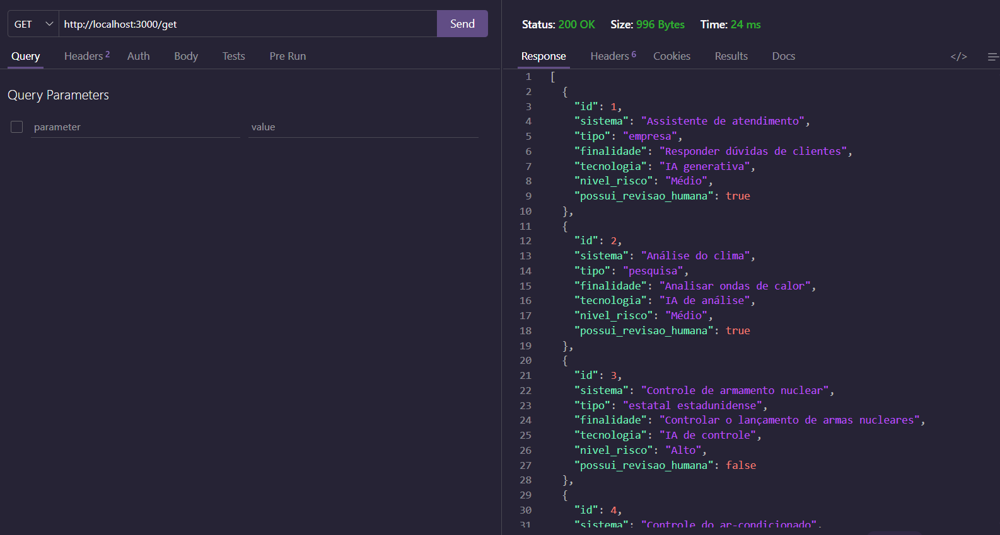
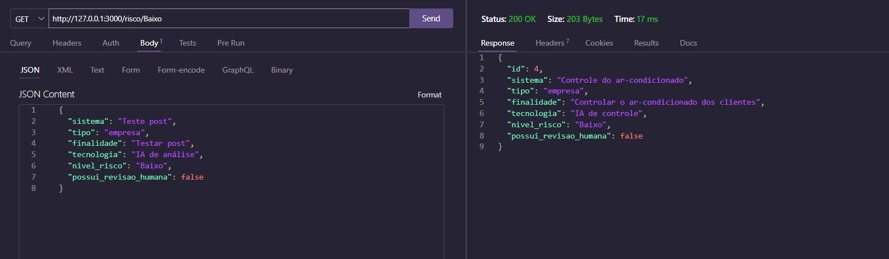
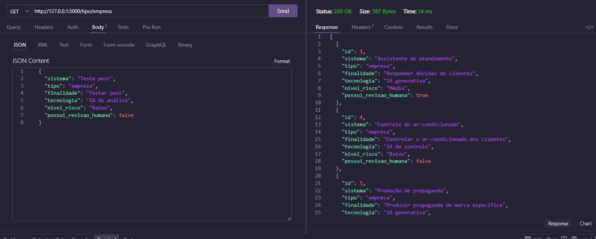
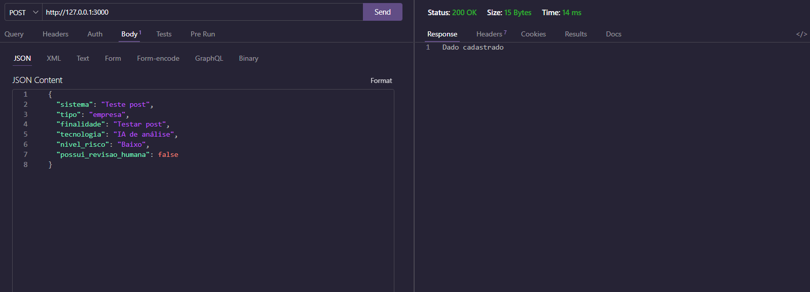
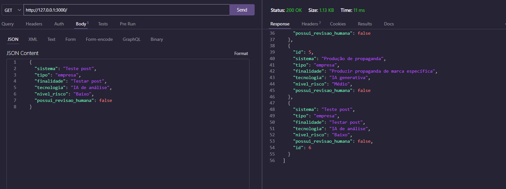
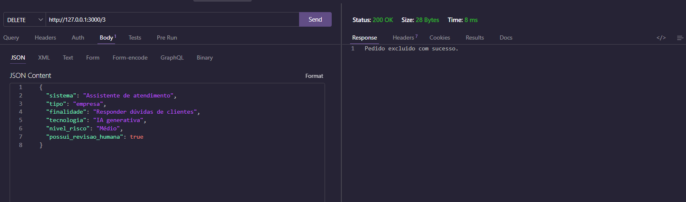
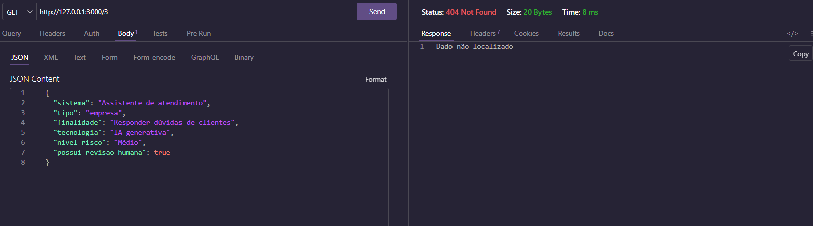
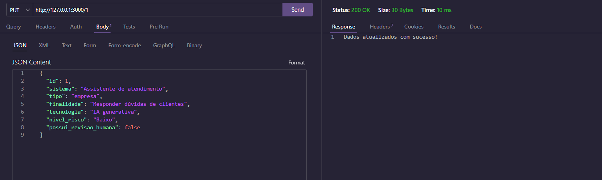
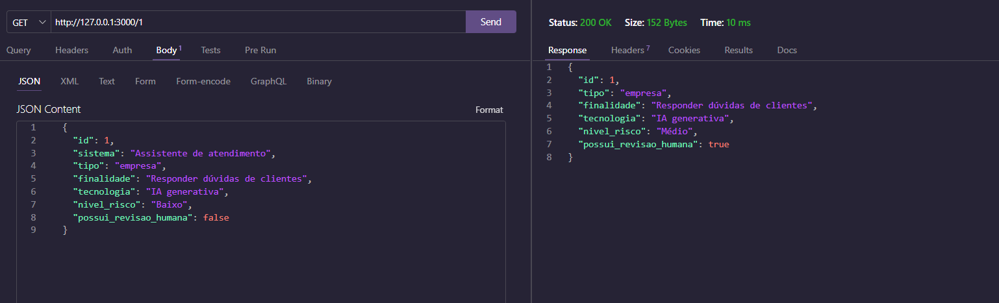

# Aula07 - VPF01 - Organização de dados de uma pesquisa de campo
- inventario.json
```JSON
[
    {
        "id": 1,
        "sistema": "Assistente de atendimento",
        "tipo": "empresa",
        "finalidade": "Responder dúvidas de clientes",
        "tecnologia": "IA generativa",
        "nivel_risco": "Médio",
        "possui_revisao_humana": true
    },
    {
        "id": 2,
        "sistema": "Análise do clima",
        "tipo": "pesquisa",
        "finalidade": "Analisar ondas de calor",
        "tecnologia": "IA de análise",
        "nivel_risco": "Médio",
        "possui_revisao_humana": true
    },
    {
        "id": 3,
        "sistema": "Controle de armamento nuclear",
        "tipo": "estatal estadunidense",
        "finalidade": "Controlar o lançamento de armas nucleares",
        "tecnologia": "IA de controle",
        "nivel_risco": "Alto",
        "possui_revisao_humana": false
    },
    {
        "id": 4,
        "sistema": "Controle do ar-condicionado",
        "tipo": "empresa",
        "finalidade": "Controlar o ar-condicionado dos clientes",
        "tecnologia": "IA de controle",
        "nivel_risco": "Baixo",
        "possui_revisao_humana": false
    },
    {
        "id": 5,
        "sistema": "Produção de propaganda",
        "tipo": "empresa",
        "finalidade": "Produzir propaganda de marca específica",
        "tecnologia": "IA generativa",
        "nivel_risco": "Médio",
        "possui_revisao_humana": false
    }
]
```

## Método para testar o projeto:
- 1 Clone o repositório
- 2 Abra com VsCode
- 3 Em um teminal CMD ou BASH, digite:
```
npm install
npm run dev
```
- 4 Teste as rotas com a extensão Thunder Client do VsCode

## Tecnologias:
- VsCode
- Node.js
- JavaScript
- JSON
- Thunder Client

## Rotas

| Método | Rota | Descrição |
| :--- | :--- | :--- |
| **GET** | `/` | Retorna a lista completa. |
| **GET** | `/:id` | Retorna um item específico pelo id. |
| **GET** | `/risco/:nivel_risco` | Retorna um item específico pelo risco. |
| **GET** | `/tipo/:tipo` | Retorna um item específico pelo tipo. |
| **DELETE** | `/:id` | Remove o item referente ao id |
| **POST** | `/` | Cadastra um novo item com auto increment. |
| **PUT** | `/:id` | Atualiza as informações do item pelo id. |

## Exemplos de requisição e testes com o Thunder Client
- Listar todos os itens:

- Buscar um item pelo ID:

- Buscar um item pelo risco:

- Buscar um item pelo tipo:

- Cadastrar um novo item usando Post e teste:


- Delete e teste:


- Put e teste (note que "nivel_risco" e "possui_revisao_humana" foram alterados):


